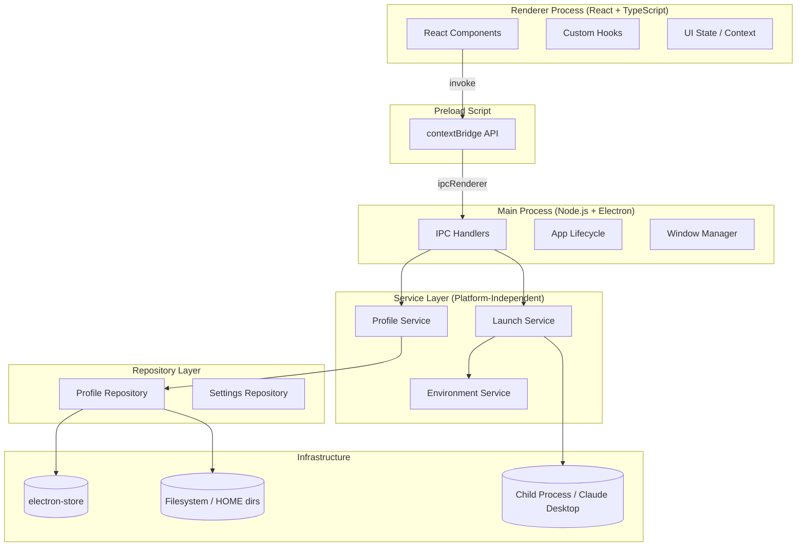
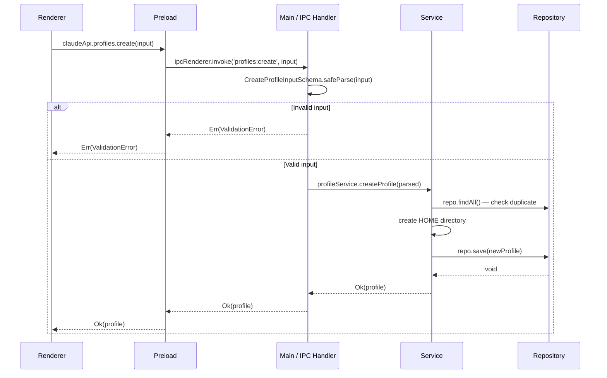
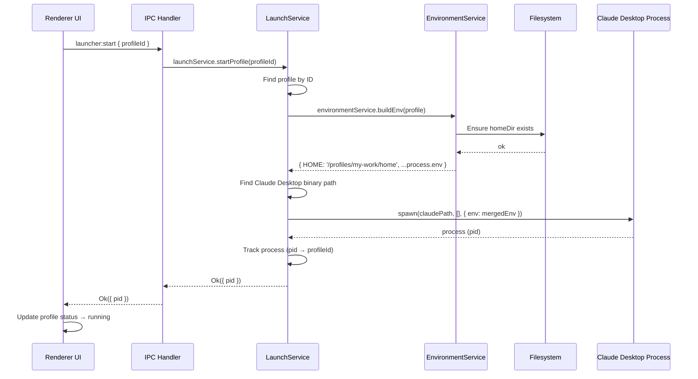
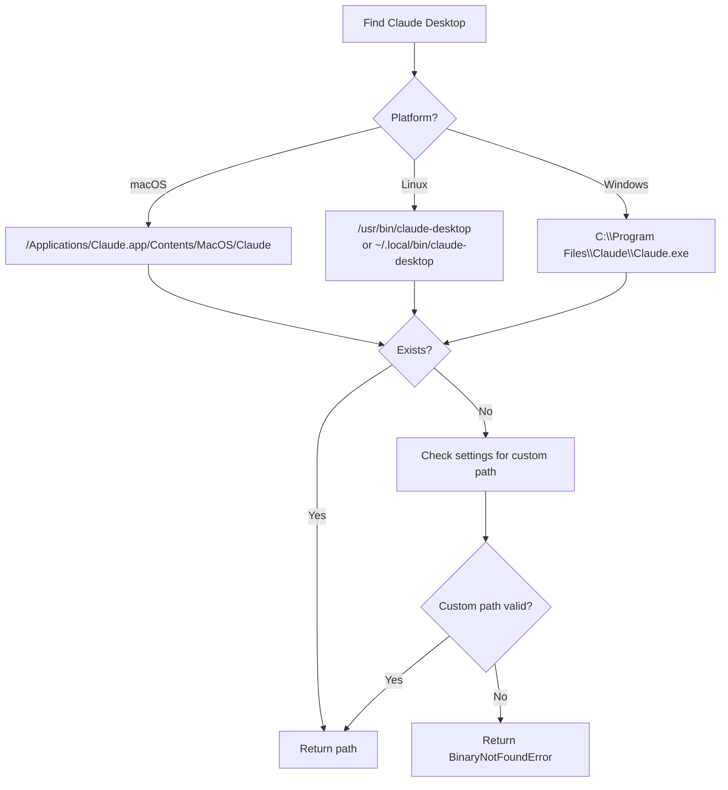
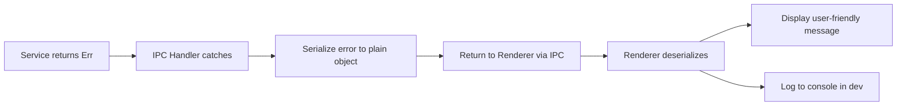
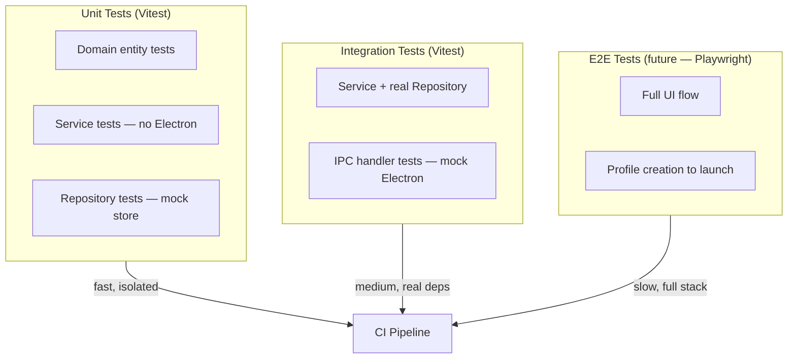

# Architecture — Claude Launcher

> Complete architecture document for Claude Launcher. All contributors and Claude Code sessions must read this before implementing anything.

---

## Architecture Philosophy

Claude Launcher is built on three core principles:

### 1. Non-Invasive by Design
The launcher never touches the Claude Desktop binary. Instead, it changes the **runtime environment** — specifically the `HOME` environment variable — before starting the process. Claude Desktop naturally stores data in the HOME directory, so each profile automatically has its own session, cookies, cache, and preferences.

### 2. Clean Architecture
Business logic is completely independent of Electron. Domain and Service layers can be tested without running Electron, which ensures:
- Logic is easy to test
- Easy to migrate to another framework if needed
- Easy to understand and maintain

### 3. AI-Friendly Structure
Each layer has a clear, non-overlapping responsibility. Each file has a single purpose. Documentation accurately reflects the code. An AI agent can understand the entire project by reading the documentation.

---

## Layered Architecture



---

## Dependency Rules

| From \ To | Domain | Service | Repository | Main | Renderer |
|-----------|--------|---------|-----------|------|----------|
| **Domain** | ✅ | ❌ | ❌ | ❌ | ❌ |
| **Service** | ✅ | ✅ | ✅ (via interface) | ❌ | ❌ |
| **Repository** | ✅ | ❌ | ✅ | ❌ | ❌ |
| **Main** | ✅ | ✅ | ✅ | ✅ | ❌ |
| **Renderer** | ✅ (types only) | ❌ | ❌ | ❌ | ✅ |

**Rule**: Dependencies only flow inward (Renderer → Main → Service → Domain), never in reverse.

---

## Module Responsibilities

### Domain Layer (`src/domain/`)

**Contains**: Types, interfaces, value objects, domain errors
**Does not contain**: Business logic, I/O, Electron APIs

```typescript
// src/domain/profile.ts
export type ProfileId = string & { readonly __brand: 'ProfileId' };

export interface Profile {
  readonly id: ProfileId;
  readonly name: string;
  readonly homeDir: string;
  readonly icon?: string;
  readonly createdAt: Date;
  readonly lastUsedAt?: Date;
}

export interface IProfileRepository {
  findAll(): Promise<Profile[]>;
  findById(id: ProfileId): Promise<Profile | null>;
  save(profile: Profile): Promise<void>;
  delete(id: ProfileId): Promise<void>;
}
```

### Service Layer (`src/services/`)

**Contains**: Business logic, orchestration, validation rules
**Does not contain**: Electron APIs, direct filesystem calls, UI concerns

```typescript
// src/services/profileService.ts
export class ProfileService {
  constructor(
    private readonly repo: IProfileRepository,
    private readonly fs: IFilesystemService,
  ) {}

  async createProfile(input: CreateProfileInput): Promise<Result<Profile, ProfileError>> {
    // 1. Validate input
    // 2. Check for duplicate names
    // 3. Create HOME directory
    // 4. Persist profile
    // 5. Return result
  }

  async deleteProfile(id: ProfileId): Promise<Result<void, ProfileError>> {
    // 1. Find profile
    // 2. Remove HOME directory
    // 3. Remove from repository
  }
}
```

### Repository Layer (`src/repositories/`)

**Contains**: CRUD operations, serialization/deserialization, storage concerns
**Does not contain**: Business logic, validation rules

```typescript
// src/repositories/profileRepository.ts
export class ProfileRepository implements IProfileRepository {
  constructor(private readonly store: Store<StoreSchema>) {}

  async findAll(): Promise<Profile[]> {
    return this.store.get('profiles', []);
  }

  async save(profile: Profile): Promise<void> {
    const profiles = await this.findAll();
    const updated = [...profiles.filter(p => p.id !== profile.id), profile];
    this.store.set('profiles', updated);
  }
}
```

### Main Process (`src/main/`)

**Contains**: IPC handlers, app lifecycle, window management, dependency injection
**Does not contain**: Business logic, React, DOM APIs

### Renderer (`src/renderer/`)

**Contains**: React components, hooks, UI state, IPC calls via preload API
**Does not contain**: Node.js APIs, Electron APIs, filesystem access

---

## IPC Architecture

### Principles

1. IPC is the **only boundary** between the renderer and main process
2. All IPC messages have **Zod schemas** for both request and response
3. Handlers **validate** before processing
4. Renderer **validates** responses before rendering
5. Channels are defined centrally — no magic strings

### Channel Definitions

```typescript
// src/shared/ipc/channels.ts
export const IPC_CHANNELS = {
  // Profile management
  PROFILES_LIST:   'profiles:list',
  PROFILES_CREATE: 'profiles:create',
  PROFILES_UPDATE: 'profiles:update',
  PROFILES_DELETE: 'profiles:delete',
  PROFILES_GET:    'profiles:get',

  // Launcher
  LAUNCHER_START:  'launcher:start',
  LAUNCHER_STOP:   'launcher:stop',
  LAUNCHER_STATUS: 'launcher:status',

  // Settings
  SETTINGS_GET:    'settings:get',
  SETTINGS_SET:    'settings:set',
} as const;

export type IpcChannel = typeof IPC_CHANNELS[keyof typeof IPC_CHANNELS];
```

### IPC Message Flow



### Preload API Contract

```typescript
// src/preload/api.ts
export interface ClaudeApi {
  profiles: {
    list: () => Promise<Result<Profile[]>>;
    get: (id: string) => Promise<Result<Profile>>;
    create: (input: CreateProfileInput) => Promise<Result<Profile>>;
    update: (id: string, input: UpdateProfileInput) => Promise<Result<Profile>>;
    delete: (id: string) => Promise<Result<void>>;
  };
  launcher: {
    start: (profileId: string) => Promise<Result<void>>;
    stop: (profileId: string) => Promise<Result<void>>;
    getStatus: (profileId: string) => Promise<Result<LaunchStatus>>;
  };
  settings: {
    get: () => Promise<Result<AppSettings>>;
    set: (settings: Partial<AppSettings>) => Promise<Result<void>>;
  };
}

declare global {
  interface Window {
    claudeApi: ClaudeApi;
  }
}
```

---

## Launch Flow

This is the core mechanism of Claude Launcher — how a profile is started.

### How HOME Isolation Works

Claude Desktop (and most Electron apps) uses the `HOME` environment variable to determine where to store:
- `~/.config/` — app config
- `~/.local/share/` — app data
- Chromium data: cookies, IndexedDB, LocalStorage

By setting `HOME=/path/to/profile/home` before spawning the process, each profile naturally has its own storage with no patching required.

### Launch Sequence



### Binary Discovery



---

## Folder Structure

```
claude-launcher/
├── CLAUDE.md                     # System prompt for Claude Code
├── package.json
├── tsconfig.json                 # Base TypeScript config
├── tsconfig.main.json            # Main process config (Node target)
├── tsconfig.renderer.json        # Renderer config (Browser target)
├── vite.config.ts                # Vite + Electron plugin config
├── electron-builder.config.ts    # Packaging config
│
├── docs/
│   ├── ARCHITECTURE.md           # This file
│   ├── IMPLEMENTATION_PLAN.md
│   ├── CONTRIBUTING.md
│   ├── DECISIONS.md
│   ├── TASKS.md
│   ├── WORKLOG.md
│   ├── CONTEXT.md
│   ├── TECHNICAL_DEBT.md
│   ├── RELEASE_PLAN.md
│   └── prompts/
│       ├── implement-pr.md
│       ├── review-pr.md
│       ├── bugfix.md
│       ├── refactor.md
│       └── release.md
│
└── src/
    ├── domain/                   # Domain layer — no external deps
    │   ├── profile.ts            # Profile entity, IProfileRepository interface
    │   ├── settings.ts           # App settings types
    │   ├── launch.ts             # Launch domain types (LaunchStatus, etc.)
    │   └── errors.ts             # Typed domain errors
    │
    ├── shared/                   # Shared between main and renderer
    │   ├── ipc/
    │   │   ├── channels.ts       # IPC channel constants
    │   │   └── schemas.ts        # Zod schemas for IPC messages
    │   ├── types/
    │   │   └── result.ts         # Result<T, E> type
    │   └── utils/
    │       └── id.ts             # ID generation
    │
    ├── services/                 # Service layer — business logic
    │   ├── profileService.ts
    │   ├── launchService.ts
    │   ├── environmentService.ts
    │   ├── binaryDiscoveryService.ts
    │   └── __tests__/
    │       ├── profileService.test.ts
    │       ├── launchService.test.ts
    │       └── environmentService.test.ts
    │
    ├── repositories/             # Repository layer — storage
    │   ├── profileRepository.ts
    │   ├── settingsRepository.ts
    │   └── __tests__/
    │       ├── profileRepository.test.ts
    │       └── settingsRepository.test.ts
    │
    ├── main/                     # Electron main process
    │   ├── index.ts              # Entry point, app setup
    │   ├── window.ts             # BrowserWindow creation
    │   ├── ipc/
    │   │   ├── profileHandlers.ts
    │   │   ├── launchHandlers.ts
    │   │   └── settingsHandlers.ts
    │   └── container.ts          # Dependency injection / wiring
    │
    ├── preload/                  # Preload scripts
    │   ├── index.ts              # contextBridge.exposeInMainWorld
    │   └── api.ts                # Typed API interface
    │
    └── renderer/                 # React application
        ├── index.tsx             # React entry point
        ├── App.tsx               # Root component, routing
        ├── components/
        │   ├── ui/               # shadcn/ui base components
        │   ├── profiles/
        │   │   ├── ProfileList.tsx
        │   │   ├── ProfileCard.tsx
        │   │   ├── CreateProfileDialog.tsx
        │   │   └── EditProfileDialog.tsx
        │   ├── launcher/
        │   │   ├── LaunchButton.tsx
        │   │   └── StatusIndicator.tsx
        │   └── layout/
        │       ├── Sidebar.tsx
        │       └── MainLayout.tsx
        ├── hooks/
        │   ├── useProfiles.ts
        │   ├── useLaunchStatus.ts
        │   └── useSettings.ts
        └── context/
            └── AppContext.tsx
```

---

## Repository Pattern

### Interface (Domain Layer)

```typescript
// src/domain/profile.ts
export interface IProfileRepository {
  findAll(): Promise<Profile[]>;
  findById(id: ProfileId): Promise<Profile | null>;
  save(profile: Profile): Promise<void>;
  delete(id: ProfileId): Promise<void>;
  exists(id: ProfileId): Promise<boolean>;
}
```

### Implementation (Repository Layer)

```typescript
// src/repositories/profileRepository.ts
export class ProfileRepository implements IProfileRepository {
  private readonly STORE_KEY = 'profiles';

  constructor(private readonly store: Store<AppStoreSchema>) {}

  async findAll(): Promise<Profile[]> {
    const raw = this.store.get(this.STORE_KEY, []);
    return raw.map(deserializeProfile);
  }

  async findById(id: ProfileId): Promise<Profile | null> {
    const all = await this.findAll();
    return all.find(p => p.id === id) ?? null;
  }

  async save(profile: Profile): Promise<void> {
    const all = await this.findAll();
    const filtered = all.filter(p => p.id !== profile.id);
    this.store.set(this.STORE_KEY, [...filtered, serializeProfile(profile)]);
  }

  async delete(id: ProfileId): Promise<void> {
    const all = await this.findAll();
    this.store.set(this.STORE_KEY, all.filter(p => p.id !== id).map(serializeProfile));
  }

  async exists(id: ProfileId): Promise<boolean> {
    return (await this.findById(id)) !== null;
  }
}
```

---

## Filesystem Abstraction

To keep the service layer testable, filesystem operations are wrapped in an interface:

```typescript
// src/domain/filesystem.ts
export interface IFilesystemService {
  exists(path: string): Promise<boolean>;
  mkdir(path: string, options?: { recursive?: boolean }): Promise<void>;
  rm(path: string, options?: { recursive?: boolean; force?: boolean }): Promise<void>;
  readdir(path: string): Promise<string[]>;
}

// src/services/filesystemService.ts — production implementation
export class FilesystemService implements IFilesystemService {
  async exists(path: string): Promise<boolean> {
    return fs.access(path).then(() => true).catch(() => false);
  }
  // ...
}

// test/mocks/mockFilesystemService.ts — test implementation
export class MockFilesystemService implements IFilesystemService {
  private dirs = new Set<string>();
  async exists(path: string) { return this.dirs.has(path); }
  async mkdir(path: string) { this.dirs.add(path); }
  // ...
}
```

---

## Dependency Injection / Wiring

The main process wires all dependencies at startup:

```typescript
// src/main/container.ts
export function createContainer(): AppContainer {
  const store = new Store<AppStoreSchema>({ schema: appStoreSchema });

  const profileRepo = new ProfileRepository(store);
  const settingsRepo = new SettingsRepository(store);
  const fsService = new FilesystemService();
  const envService = new EnvironmentService();
  const binaryService = new BinaryDiscoveryService(settingsRepo);
  const profileService = new ProfileService(profileRepo, fsService);
  const launchService = new LaunchService(profileRepo, binaryService, envService);

  return {
    profileService,
    launchService,
    settingsRepo,
  };
}
```

---

## Error Handling

### Error Hierarchy

```
AppError (base)
├── DomainError
│   ├── ProfileNotFoundError
│   ├── ProfileAlreadyExistsError
│   └── ProfileValidationError
├── LaunchError
│   ├── BinaryNotFoundError
│   ├── ProcessAlreadyRunningError
│   └── ProcessStartFailedError
└── StorageError
    ├── ReadError
    └── WriteError
```

### Error Flow



---

## Logging

- Development: `console.log` / `console.error` with context prefix
- Production: structured logging to file (planned for v0.2)
- Main process log file: `app.getPath('logs')/claude-launcher.log`
- Renderer: log via IPC so the main process handles it (no direct file logging from renderer)

---

## Testing Strategy



### Test Commands

```bash
pnpm test              # Run all unit + integration tests
pnpm test:watch        # Watch mode
pnpm test:coverage     # With coverage report
pnpm typecheck         # TypeScript type checking
pnpm lint              # ESLint
```

---

## Future Extensibility

| Feature | Extension Point |
|---------|----------------|
| Multiple launchers | `ILaunchStrategy` interface — inject different strategy per platform |
| Cloud sync | New `IProfileRepository` implementation (e.g., `CloudProfileRepository`) |
| Plugin system | Plugin interface — services accept plugin registries |
| Multiple app targets | `IAppTarget` interface — not just Claude Desktop, any Electron app |
| Themes | CSS variables + theme provider — no logic change needed |
| CLI | Domain + Service layer reused directly — no Electron dependency |

---

## Security Considerations

1. **Context Isolation**: `contextIsolation: true` — renderer has no Node.js access
2. **No Node Integration**: `nodeIntegration: false` — renderer runs as a plain browser
3. **Preload sandboxing**: Only necessary APIs are exposed via `contextBridge`
4. **Input validation**: All input from renderer goes through Zod validation in main
5. **Path traversal**: Profile home paths are validated before directory creation
6. **Process isolation**: Child processes run with isolated environment
